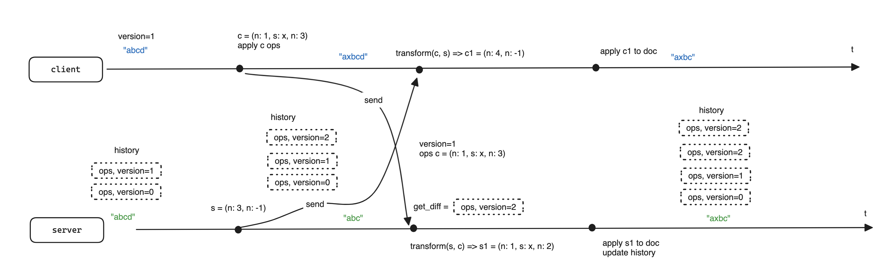
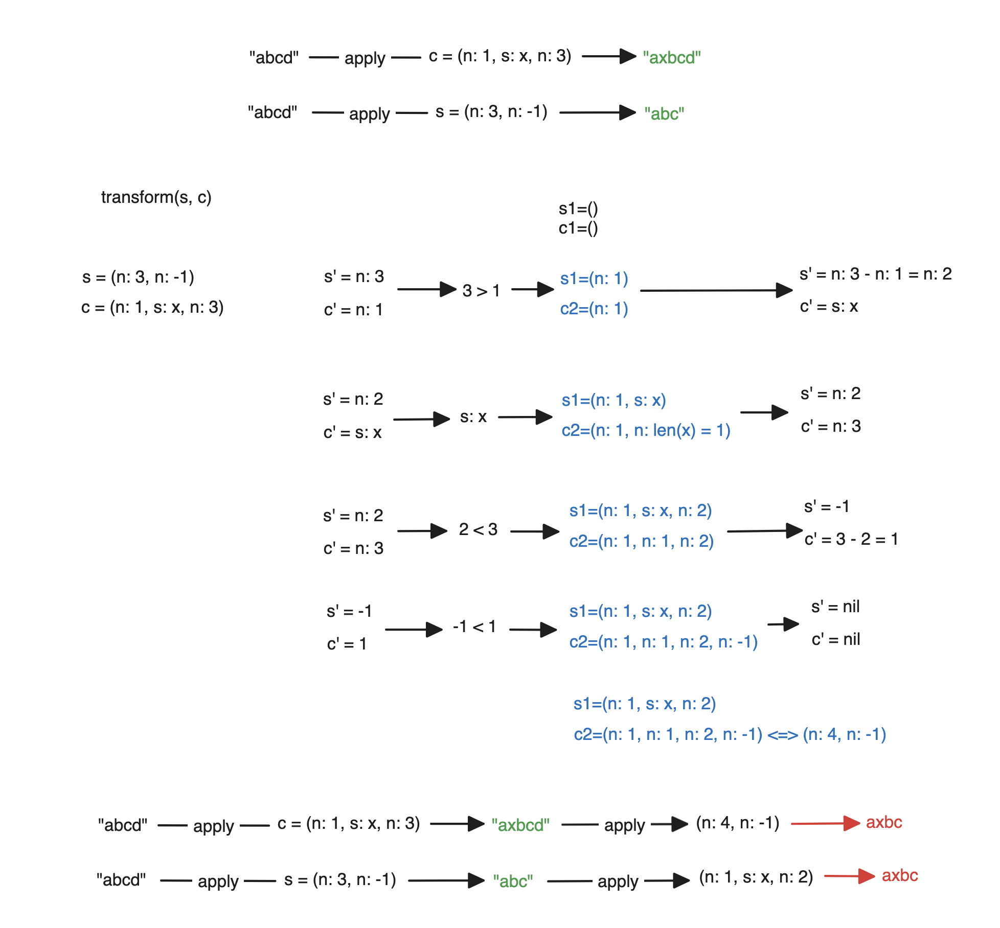
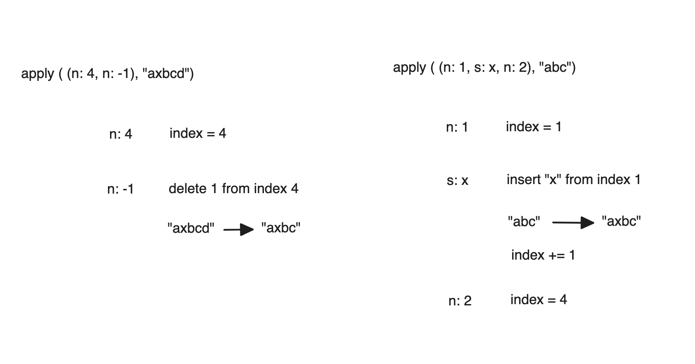

# Real time **collaboration on editor**

💡 *Like Notion, Google Docs, etc…* 

### Operational Transformation

*Data distributed. ALL in diagram.*

 

#### Transformation
*describe above case*
 

#### Appy operator to doc

*describe above case*
 

