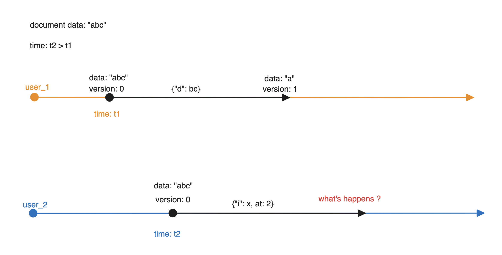
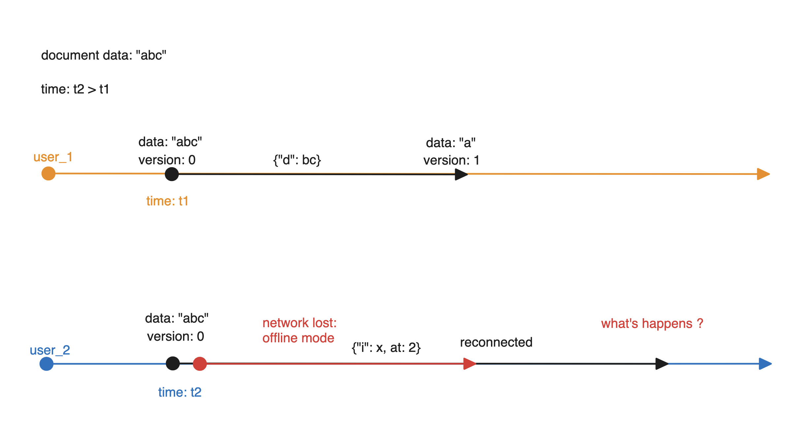

# Real time **collaboration on editor**

💡 *Like Notion, Google Docs, etc…* 

## Contents

1. Contexts/problems
1. Algorithms
1. Projects/open sources
1. System Architect
1. Data storage and Operational Transformation

### Contexts/Problems

- Real-time collaborative editor: Then we open a real-time collaborative editor that allows multiple users to edit the document, each client(user) join to edit must follow:
    1. Clone the original document to storage (local, cloud, etc.).
    2. Manually submit(publish, push, commit)
    3. Update(refresh, pull, download, sync).
    
    > Like Git
    > 
- Problems: Due to the delayed nature of async editing, multiple users end up editing the same line, word, element, row, data, filed → conflicts → required merging with two options:
    - Automatically overwriting
    - User edits

### Algorithms

💡 *Algorithms solve the aforementioned problems.*

#### 1. Operational Transformation (OT)
- The technology behind the collaboration features in Apache Wave and Google Docs. 
- Visualization of OT: [here](http://operational-transformation.github.io/)
- Whitepapers: [here](https://svn.apache.org/repos/asf/incubator/wave/whitepapers/operational-transform/operational-transform.html) 

ref: [https://en.wikipedia.org/wiki/Operational_transformation#:~:text=Operational transformation (OT) is a,editing of plain text documents](https://en.wikipedia.org/wiki/Operational_transformation#:~:text=Operational%20transformation%20(OT)%20is%20a,editing%20of%20plain%20text%20documents).
#### 2. Differential Synchronization
ref: https://static.googleusercontent.com/media/research.google.com/en//pubs/archive/35605.pdf
#### 3. **Atomic broadcast**

ref: [https://en.wikipedia.org/wiki/Atomic_broadcast#:~:text=In fault-tolerant distributed computing,the same sequence of messages](https://en.wikipedia.org/wiki/Atomic_broadcast#:~:text=In%20fault%2Dtolerant%20distributed%20computing,the%20same%20sequence%20of%20messages).

In this document we will Operational Transformation (OT)

### System Architect

#### Components
- Database: We need fast read/write, so a key-value database is the best choice. I recommend MongoDB for this case.
- Cache: Our system is a real-time collaboration tool, which is why we need to cache data in memory for fast read access.
- Operational Transformation (OT): The implementation of OT depends on the type of data stored in MongoDB. In this document, I will consider two types: strings and JSON. For more details, please refer to this [section](#data-storage-and-operational-transformation).
- Server: In a real-time system, we will need to open a web-socket server.

#### Flow
1. Connection flow

- Clients (users) will connect to the WebSocket server with a document_id and join the channel. The document_id is also a channel_id, which allows other users to connect as well.

- When the server receives the document_id (channel_id), it will fetch the document from MongoDB and return it to all users in the channel. If the server does not find a document with that id, it will create one and so on.

- We can cache the document data to Redis because we cannot always request from the database when a new user joins the channel or edits the documents.
 

 

2. Editing flow

- Suppose that `user_1` and `user_2` are connected to the server on channel A with channel ID `channel_id_1`.
- `user_1` will insert the character `a` at index `0`. The client will emit an `op` event with a payload that includes `ops: [{"insert": "a", "at": "0"}]`.
- When the server receives an `op` event, the server has an Operational Transformation component to apply that `ops` to the document data and increase the version of document.
- When the Operational Transformation process is complete, the server will synchronize the new document with `user_2`.
- Make sure we have updated the new document to the database and Redis.

 

 

#### Challenges

1. Race condition/consistency

1. Network Latency

2. Memory lake

### Data storage and Operational Transformation