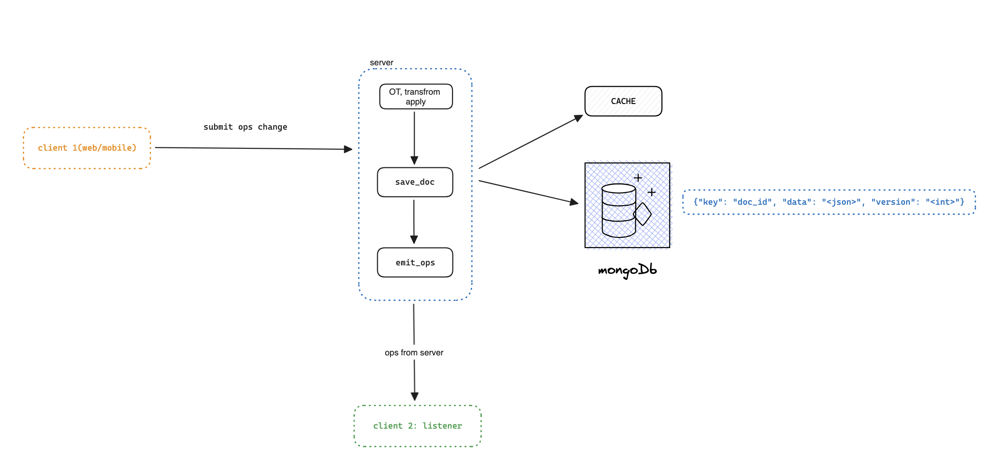

# Real time **collaboration on editor**

💡 *Like Notion, Google Docs, etc…* 

## Contents

1. [Contexts](#contexts)
1. [System Architect](#system-architect)
1. [Operational Transformation](#operational-transformation)

### Contexts

- Real-time collaborative editor: Then we open a real-time collaborative editor that allows multiple users to edit the document, each client(user) join to edit must follow:
    1. Clone the original document to storage (local, cloud, etc.).
    2. Manually submit(publish, push, commit)
    3. Update(refresh, pull, download, sync).
    
    > Like Git
    > 
- Problems: Due to the delayed nature of async editing, multiple users end up editing the same line, word, element, row, data, filed → conflicts → required merging with two options:
    - Automatically overwriting
    - User edits

First, we need take overview before invoke to detail

### System Architect

#### Components
- Database: A database will be used to save documents. I have decided to use MongoDB.
- Cache: We need fast read access: Redis for this proposal.
- Operational Transformation (OT): We will use the OT Algorithm to solve our problems. Please check the details in this section section.
- Server: Of course! We will pick up a web-socket server.

#### Flow
1. Connection flow

- Clients (users) will connect to the WebSocket server with a document_id and join the channel. The document_id is also a channel_id, which allows other users to connect as well.

- When the server receives the document_id (channel_id), it will fetch the document from MongoDB and return it to all users in the channel. If the server does not find a document with that id, it will create one and so on.

- We can cache the document data to Redis because we cannot always request from the database when a new user joins the channel or new operator became.

2. Editing flow

- Suppose that `user_1` and `user_2` are connected to the server on channel A with channel ID `channel_id_1`.
- `user_1` will insert the character `a` at index `0`. The client will emit an `op` event with a payload that includes `ops: [{"insert": "a", "at": "0"}]`.
- When the server receives an `op` event, the server has an OT processto apply that `ops` to the document data and increase the version of document.
- When the OT process is complete, the server will synchronize the new document with `user_2`.
- Make sure we have updated the new document to the database and Redis.

### Operational Transformation
- Operational: Apply an operator to a snapshot and return a changed snapshot.
    -  ex: `{insert: "a", at: 0}`, `{delete: "b"`
- Transformation: Fix conflicts or inconsistencies of the operators.

#### How Transformation work
...*in-processing*
### Acknowledgement
> *Clients wait for acknowledgement from server before sending more operations*
